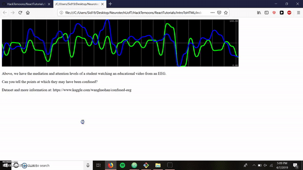

# Introduction to HTML, CSS, and JavaScript

### Overview
This is a frontend tutorial meant for complete beginners. In this project, we will first make a basic webpage using HTML / CSS to display EEG brainwave data from a CSV file.

<details>
<summary>Part 1: HTML Programming **(click here!)**</summary>

Create a new folder, and then create a file inside called ```index.html```. Every HTML page starts off with the initial structure below.
```html
<!DOCTYPE html>
<html>
  <head>
  </head>
  <body>
  </body>
</html>
```
There is one large ```<html>``` tag, with a  ```<head>``` and a ```<body>``` tag nested inside. We also call tags "HTML elements".


The ```<head>``` and ```<body>``` tags split up the region of the webpage, as shown below.

<a ></a>

All HTML elements placed inside the ```<body>``` tag will be shown in the CONTENT region.

For example, let's add a ```<p>``` element inside the ```<body>``` tag, like so:

```html
<body>
  <p>
    Hello world!
  </p>
</body>
```

This should give us a plain webpage that prints "Hello world!" in the CONTENT region. Great! You can remove this element now if you want.

Now we will insert the following HTML element inside the ```<body>```  tag

```html
<canvas id="chart" width="1000" height="200"></canvas>
```

Here we've made a  ```<canvas>``` element that has a width of 1000 pixels, and a height of 200 pixels. You can think of this element as a blank canvas on the webpage, whaich we can draw on using JavaScript (our next step)

Now download the following files, and place them in your project folder:  [smoothie.js](https://github.com/neurotechuoft/HackTernoons/blob/master/ReactTutorials/IntroToHTML/smoothie.js),  [EEG_data.csv](https://github.com/neurotechuoft/HackTernoons/blob/master/ReactTutorials/IntroToHTML/EEG_data.csv), [EEGDataParsedAttention.csv](https://github.com/neurotechuoft/HackTernoons/blob/master/ReactTutorials/IntroToHTML/EEGDataParsedAttention.csv), [data.json](https://github.com/neurotechuoft/HackTernoons/blob/master/ReactTutorials/IntroToHTML/data.json)

EEG_data is a csv file from real EEG data (of confused students, see article at: https://www.kaggle.com/wanghaohan/confused-eeg)! I've taken the 'Attention' column, and transposed it into EEGDataParsedAttention.csv. And then, I stored this into a JavaScript object, and placed that data in data.json. I've done this manually, but perhaps you can write a script to automate this process? (an important task in Data Science)

Now we will add some JavaScript. Insert an HTML ```<script>``` element right below the body tag, as so:

```html
<!DOCTYPE html>
<html>
  <head>
  </head>
  <body>
  </body>
  <script>
  </script>
</html>
```

The HTML ```<script>``` element works a bit differently. Everything inside a ```<script>``` tag will be JavaScript code that is run on the webpage. The ```<script>``` element does not describe what the webpage looks like, but rather adds functionality to the webpage.

[There's a great optional video here which goes into the details of including JavaScript in an HTML page.](
https://www.youtube.com/watch?v=AD5hxsFJc4o&t=120s)


Back to the project. We downloaded a few data/code files from before and placed them in our project folder. Let's add them to our webpage by adding these two elements:
```html
  <script src="./smoothie.js"></script>
  <script src="./data.json"></script>
```

Beside the ```script``` text of the ```<script>``` tag we added an ```src``` attribute. This attribute is assigned a path to a JavaScript file, and all the code inside that JS file is placed inside the tag. Check out the [optional youtube video](https://www.youtube.com/watch?v=AD5hxsFJc4o&t=120s) to learn more about this idea.

Note also that in file paths, "./" denotes your current directory. You can create a new folder called ```data```, place all the EEG data files in that folder, and then change the script ```src``` to be "./data/data.json" to clean things up. We'll be doing that here, so now we have instead:

```  <script src="./data/data.json"></script>
```

In addition, copy and paste the following third script element, as such:
<details>
<summary>Script element code **(click here!)**</summary>

```html
<!DOCTYPE html>
<html>
  <head>
  </head>
  <body>
  </body>
  <script src="./smoothie.js"><script>
  <script src="./data.json"></script>
  <script>
    console.log(data);
    // Every 500ms, read a piece of data from the input string.
    var attentionData = data.attention;
    var meditationData = data.meditation;
    var dataIndex = 0;
    var attentionStream = new TimeSeries();
    var meditationStream = new TimeSeries();
    setInterval(function() {
      attentionStream.append(new Date().getTime(), attentionData[dataIndex]);
      meditationStream.append(new Date().getTime(), meditationData[dataIndex]);
      dataIndex++;
    }, 500);
    function createTimeline() {
      var chart = new SmoothieChart();
      chart.addTimeSeries(attentionStream, { strokeStyle: 'rgba(0, 255, 0, 1)', fillStyle: '', lineWidth: 4 });
      chart.addTimeSeries(meditationStream, { strokeStyle: 'rgba(0, 0, 255, 1)', fillStyle: '', lineWidth: 4 });
      chart.streamTo(document.getElementById("chart"), 500); // **
    }
  </script>
</html>
```
</details>


Try and figure out how that JavaScipt code works. It will help a lot to check out documentation on smoothie.js, at http://smoothiecharts.org/tutorial.html.

By the end of this section, you should have something that looks like this!

<a ></a>

</details>
<details>
<summary>Part 2: Intro to CSS Grid **(click to open!)**</summary>

Now for further organizing where to lay out the components of our webpage, we use the CSS grid. A great tutorial on that topic was created by Mozilla, at: https://hacks.mozilla.org/2017/10/an-introduction-to-css-grid-layout-part-1/

Try to re-organize the location of where the text and graphs are located!

</details>

#### Part 2: Connecting to Python backend (Not necessarily the order, but would like to have this eventually included in the tutorial)
