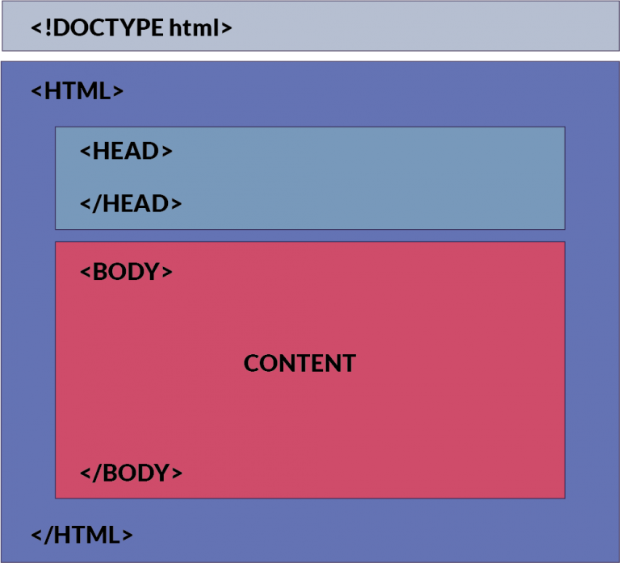

# Introduction to HTML, CSS, and JavaScript

### Overview
This is a frontend tutorial meant for complete beginners. In this project, we will first make a basic webpage using HTML / CSS to display EEG brainwave data from a CSV file.

#### Part 1: HTML Programming
Create a new folder, and then create a file inside called ```index.html```. Every HTML page starts off with the initial structure below.
```html
<!DOCTYPE html>
<html>
  <head>
  </head>
  <body>
  </body>
</html>
```
There is one large ```<html>``` tag, with a  ```<head>``` and a ```<body>``` tag nested inside. We also call tags "HTML elements".


The ```<head>``` and ```<body>``` tags split up the region of the webpage, as shown below.

<a ></a>

All HTML elements placed inside the ```<body>``` tag will be shown in the CONTENT region.

For example, let's add a ```<p>``` element inside the ```<body>``` tag, like so:

```html
<body>
  <p>
    Hello world!
  </p>
</body>
```

This should give us a plain webpage that prints "Hello world!" in the CONTENT region. Great!

Now we will insert the following HTML element inside the ```<body>```  tag

```html
<canvas id="chart" width="1000" height="200"></canvas>
```

Here we've made a  ```<canvas>``` element that has a width of 1000 pixels, and a height of 200 pixels. You can think of this element as a blank canvas on the webpage, which we can draw on using JavaScript (our next step)

Now download the following files, and place them in your project folder:  [smoothie.js](https://github.com/neurotechuoft/HackTernoons/blob/master/ReactTutorials/IntroToHTML/smoothie.js), 
